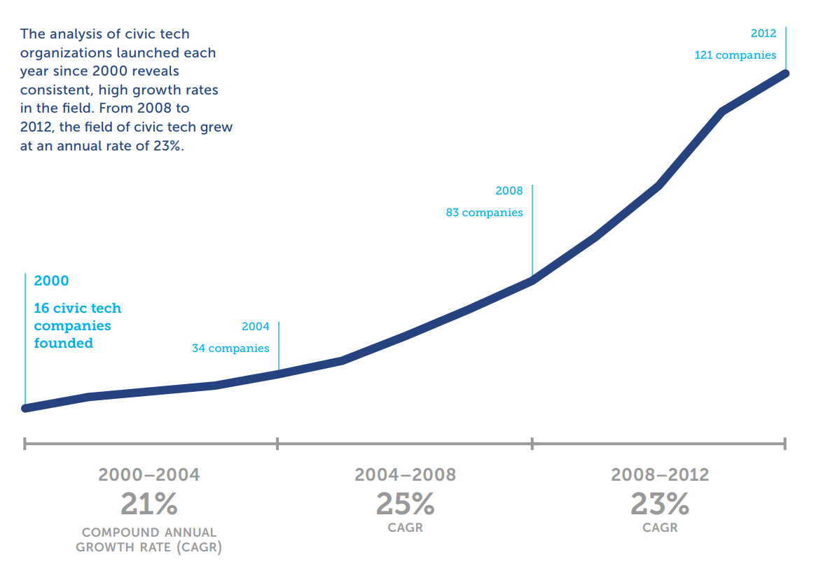
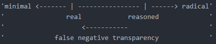
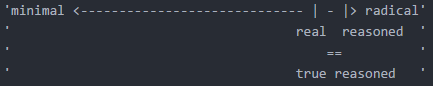
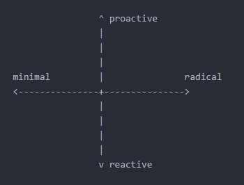

# outline
rough outline for [lit review](https://media.tenor.com/images/518d7e71a8e8855311eb38b41616198d/tenor.gif)

### sections:
- [abstract](#abstract)
- [motivation](#motivation-for-review)
- [framework](#conceptual-framework)
- [review](#compiled-review)
- [synthesis](#synthesis)

## abstract
*NOTE:* will be returning to this section as motivation and framework are laid out.

### temporary abstract
with the rise of information technology permeating into all areas of government, academics and citizen activists have turned towards the use and creation of civic technology in order to better utilize and understand the who, what, where, when, why, and how of government processes. while many of the efforts from academia and citizens to produce these civic technologies has been encouraged by their respective government organizations, there are also clear cases where civic technology has forced the organization to a higher standard, usually when dealing with transparency. we argue that in civic technology has created a new model for transparency in government organizations. a model that includes both false transparency as a state but additionally adaptive transparency as a method. this review details how transparency in government should be understood, through transparency processes and

## motivation for review

1. [rise in civic technology creation](#rise-in-civic-technology-creation)
2. [government adoption of information technology and data governance increasing](#government-adoption-of-information-technology)
3. [transparency and data leak as political arguments](#transparency-as-a-political-argument)
4. [confusion over roles and mistrust of past entities in debate](#mistrust-of-long-term-entities)
5. [planning for future growth in government data generation](#forward-thinking)
6. [propose a general model of how transparency is handled in current information age](#modeling-transparency-and-government-behavior)

### rise in civic technology creation
*this can serve as a kind of background on civic technology section as detailing the different areas of civic technology exploration that has been done is a rather large topic and before we delve into transparency technology the reader should have a general understanding of how civic technology has already changed other areas of civic engagement*

there are a couple of main topics of civic technology, and many definitions are offered in accompaniment.

while i believe civic technology can be anything that falls under my definition:
> usually information technology, any technology that enables community, organization, or citizen engagement with other individuals or public services; encouraging citizen communication, improving government infrastructure, and generally aiming to improve a public good.

there are many other definitions that focus on more specific areas:

for a targeted definition regarding digital engagement we can look to Mossberger's definition:
> digital citizenship is the ability to participate in society online.

expanding this from citizenship to the actual technology being discussed, allows for a broader definition regarding digital engagement:
> civic technology is a group of technologies that encourage and enable citizens to conduct government interaction through the use of information technology.

*etc., etc., etc.*

regardless of how you choose define civic technology, whatever scope you have, you can still see the expansion and creation of more civic technologies. as the knight foundation claims, for the past 12 years, civic technology has been growing consistently about 23% every 4 years.

with an estimated 192 varying civic technology companies in 2012.

while the explosion of civic technology is an area to be studying on its own, we will be focusing on civic technology that is set in data utility and what is often referred to as 'open data', 'open government', or 'e-governance'. discussing how rapidly the civic technology sector is relevant to frame that regardless of where you stand on civic technology, it is proving a very lucrative and viable market, for all sub-sectors, whether they be community organizing, or our own topic, data utility and transparency.

### government adoption of information technology
in the previous section, we discussed how civic technology companies were rapidly expanding and profiting, however it isn't just the 'private' (read: indirect affiliation with public sector) sector that is adopting civic technology.

civic technology has now become a talking point for political parties and individuals.

starting in the clinton administration, the push to include civic engagement in a digital sense had begun. the bush administration, while constantly under fire from press and citizens regarding their level of secrecy about many topics, still took many great strides toward transparency through civic technology.

> 'making information available online about meetings held between outside groups and the administrator of the white house office of information and regulatory affairs'

> 'invested significant resources and management efforts in creating the internet portal regulations.gov, and then taking steps to use that portal to make available all federal agencies supporting materials for the new rulemaking proceedings'

and while the bush administrations work towards digital and information technology engagement were admirable, then candidate obama pushed in on the opacity the bush administration kept, and campaigned on accountability and transparency through technology. in office, the obama administration, reconstructed FOIA policies and created web portals for varying public organizations.

through NGO's pushing for higher levels of transparency from all candidates, the call for 'streamlining the FOIA request process, and encouraging agencies to proactively release records using online document repositories' were loud and clear.

and while the calls were at the federal level, the ideas were passed down from above, encouraging all organizations when possible to proactively publish data for citizens to understand the political and legislative processes occurring.

*the transparency president*

### transparency as a political argument
transparency and accountability have become two topics so related that civic technology has begun to address both. with online repositories of documents for journalists to sift through and create and understand a story, and yet still other sites like change.org, to then address and request accountability for the actions being seen in the repositories.

> '80% of americans view making the federal government more open and accountable to be an important priority'

> 'by making more information available, the public can then participate more thoughtfully in the governmental process, sharing new information or raising questions about the adequacy of proposed governmental solutions'

> 'transparency can make abused and mistakes by government officials less likely, as those officials know that ordinary citizens, organized interest groups, the media, and other government officials can more easily monitor the workings of the federal government'

*the transparency president*

it is these sentiments that have created the transparency political argument. as we saw in recent elections, and specifically the most recent presidential election, transparency was called for multiple times, against both parties. transparency is now a large part of the political process. citizens now have more access to information at all times than ever before and their ability to judge the data for themselves is at an all time, but are still requesting more.

how does this relate to civic technology however? as we will discuss later, there are many types of transparencies produced by civic technology, from both public and private spaces and these technologies are what we claim have helped lead to citizens becoming more actively engaged with transparency and data utility. whether it be indirect interaction with them or direct, the creation and utilization of these civic technologies should be thought of as a primary reason for the expansion of transparency and accountability as political arguments.

### mistrust of long term entities
from above, when discussing indirect interaction with civic technologies, we have to understand what that means for the common citizen. while civic technologies are starting to expand to focus on encouraging a common user, the original use cases for many transparency technologies was targeted at journalists.

from a high level, the reasoning behind this is that there is just too much data to sift through, understand, and explain for a single person, if you target your civic technology at a news organization(s) as the primary user, then what you get is a more streamlined method of developing public accountability stories.

we look to 'wikileaks' as the most famous of these civic technologies to take on government accountability and transparency.

**explain wikileaks in full here and give background**

however, even though wikileaks was created to encourage and explain inner government workings, the public didn't respond in the way many predicted.

when wikileaks tried to produce a condensed, edited version of a group of documents, many believed they were trying to spin a story from nothing, and on other occasions when they didn't do anything and let the data sit, no one did anything with it because it was so hard to understand.

this is the mistrust we are talking about. citizens having access to their own data sets, without cost, without restriction has led to mistrust of journalists in reporting the data.

civic transparency technology was created with an emphasis on delivering radical transparency to a governmental body but was shot down because when the story went against their political leanings, they didn't trust the publisher or the technology any more.

*wikileaks: the illusion of transparency*

### forward thinking
onto big picture ideas, why are we here, doing this review. we need to look forward and understand the implications of some of the technologies being created, potential for expansion, etc.

as mentioned previously mentioned, the current trend in civic technology is a 23% growth every 4 years. this is incredibly growth for a relatively new industry, where will the sector go and how will it change the public sector.

in regards to transparency, civic technologies have started to abandon the model of publishing leaks and instead innovating in information and education design so that any user can understand the data that has already been published. when something is unsettling to many users, creating FOIA requests, or requesting additional services from the respective agency is the go to.

leaks are just as common, if not more common, in the current administration, so where do we place these in the future, is the ideal system one of radical proactive transparency or are leaks forever going to be the norm. we propose that it is the transparency technology that has created the rise in leaks and we will continue to see leaks more often than not, as more civic technology and information technology becomes entwined with government agencies.

### modeling transparency and government behavior
lastly, we propose a framework for how to view civic transparency technologies. one which can be applied to not only the government institutions themselves but also the 'private' organizations creating transparency technologies.

creating a model for understanding the various types of transparency will allow for abstraction and better conceptual knowledge of how civic technologies have, and will change the political landscape of the future.

## conceptual framework

### multiple models for explaining transparency
1. [matrix](#maxtrix-transparency)
2. [single dimension classified](#single-dimension-classified-transparency)
3. [two dimensional](#two-dimensional-transparency)
4. [other models for transparency](#other-models-for-transparency)

### matrix transparency
to be used when simple classification is desired

##### template
|     | reasoned | radical
| --- | --- | ---
| proactive | ????? | ?????
| *example-p* | ????? | ?????
| reactive | ????? | ?????
| *example-r* | ????? | ?????

##### filled
|     | reasoned | radical
| --- | --- | ---
| proactive | dedicated | indiscriminate
| *example-p* | *press release* | *data.gov*
| reactive | contained | reconciled
| *example-r* | *hearing* | *report*

### single dimension classified transparency
to be used when classification of proactive or reactive is simple but transparency is complex

**false negative:**
   1. the data available has less information than what the organization established as public knowledge
   2. the data present reveals that the organization's label of reasoned transparency is too boastful of what is actually present, due to accident or intention

**reasoned:**
   1. the data available contains approximately what the organization established as public knowledge
   2. the data present reveals competence and understanding in the level of transparency desired by the organization

**false positive:**
   1. the data available contains more information than what the organization established as public knowledge
   2. the data present reveals that the organization's label of reasoned transparency is understated of what is actually present, due to accident or intention

**radical:**
   1. the data available contains all possible information from the organization and is established as public knowledge

**interactions:**
   1. it is important to note that this should be read on an axis, where minimal is on one side and radical transparency on the other
   2. at some point along the axis, an organization has their own individual reasoned transparency, whether it be more towards minimal, or radical transparency is determined by their internal methods
   3. their real transparency, is another point on the axis that is determined by the organizations constituents and where they believe the real transparency actually is
   4. the space between the points can then be labeled by the above definitions

**example:**

in this example, there is a false negative transparency, exaggerated, from what the organization claims is available for public knowledge vs. what the public actual deems is available for public knowledge.

in this example, while there is a slight false negative transparency, the organization is claiming near radical transparency in their public knowledge data, and the public agrees that is near radical transparency, thus making the separation ignorable, resulting in a true reasoned transparency.

### two dimensional transparency
utilizing single dimensional classified transparency for definitions for the x axis,
use the y axis to describe the complexity of action.

### other models for transparency
while not necessarily a differing model from matrix transparency, the original definition proposed for **reasoned transparency** came from 'The Transparency President' and was described as simply *'government officials offering explicit explanations for their actions.'*

this definition works well for understanding a singular concept however it doesn't allow for insight into interactions between multiple concepts of transparency, action (reactive to proactive), state (minimal to radical), and importantly: falsity (organizational insincerity).

due to this definition of **reasoned transparency**, we propose the definition of *'what data government officials establish is public knowledge'* to allow for interaction between concepts.

## compiled review
LOT OF WORK TO DO HERE

### Concepts to Cover
- [Civic Technology](#civic-technology)
   - [Voting](#voting)
   - [Resident Feedback](#resident-feedback)
   - [Data Access](#data-access)
      - [Information Crowdsourcing](#information-crowdsourcing)
      - [Open Data](#open-data)
      - [Data Leak](#data-leak)

### Civic Technology
there have been many definitions proposed

# synthesis
summary after review

its a tl;dr: of a tl;dr....
