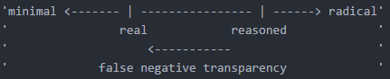
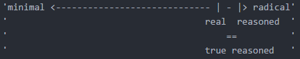

# Modeling Civic Transparency Technology: a review of literature on public facing transparency technologies

### Dr. Nicholas Weber
University of Washington, Seattle Washington, USA

### Jackson Brown
University of Washington, Seattle Washington, USA

## Sections:
- [Abstract](#abstract)
- [Motivation](#motivation-for-review)
- [Conceptual Framework](#conceptual-framework)
- Review
   - [Civic Technology Overview](#civic-technology)
   - [Voting Technology](#voting-technology)
   - [Data Access](#data-access)
      - [Information Crowdsourcing](#information-crowdsourcing)
      - [Open Data](#open-data)
      - [Data Leak](#data-leak)
- [Synthesis](#synthesis)

## Other Information:
- [Consolidated Reading Notes](reading_general_notes/All-Notes-jmb.md)
- [Sources](full/cite.md)

## Abstract

Over the last decade innovations in information communication technologies have had a transformative effect on interactions between citizens and their government - creating the potential for greater accountability and more meaningful engagement. But, ICTs have also been shaped by citizen demands for greater government transparency, and in particular access to information in readily usable, digital forms. Emerging 'civic technologies' for transparency therefore depend upon accurate, trustworthy, and timely release of government information. In the following paper we describe innovations in civic technologies that facilitate three forms of government transparency through information release: 1. Proactive Transparency, which includes open data initiatives to release machine-readable structured information to the public; 2. Reactive Transparency, which includes responses to public records requests, and compliance with freedom of information laws, and; 3. False Transparency, which includes civic technologies that expose gaps between state actions and actors, and their public disclosures. We conclude with a discussion of the potential futures for civic technologies to facilitate reasoned, accountable, and radical forms of transparency.  

### Research Questions:

In the following sections we seek to answer two specific research questions.

* First, how have research, development, or design practices within civic technology changed over the last decade? What events, policies, technological innovations, or regime changes have influenced this evolution?

* Second, As civic technologies have matured, what forms of transparency do they facilitate? How do these forms of transparency support, or prohibit government accountability?

### Key Terms:
civic technology, engagement technology, civic engagement, voting technology, civic feedback, data access, open data, data leak, data transparency, open data, false transparency

### Key Definitions:
#### Civic Technology:
'Any technology that is used to empower citizens or help make government more accessible, efficient, and effective.' - Omidyar Network

'Technology used to deepen the democratic relationship between citizens and their state.' - Brookings

'Usually information technology, any technology that enables community, organization, or citizen engagement with public services; encouraging citizen communication, improving government infrastructure, generally improving the public good.' - Team, on generalized civic technology < ---- where did this come from?

'Usually information technology, any technology that not only enables a community, organization, or citizen engagement with public services, but additionally, may improve government infrastructure, provide transparent insight into process and outcomes, or allow self-selected participation.' - Team, on transparency technology < --- Where is this from?

"the design and use of technology to support both formal and informal aspects of government and public services" (Boehner and DiSalvo, 2016)

"Online and digital technologies that enable citizens to hold governments to account" (Rumbul, 2015)

Civic technologies are occasionally described in terms of affordances (Taylor et al. 2015), such that they offer new opprotunities for "ecologies of people, practices and data forms for generating, viewing and possibly analyzing data in matters of civic concern" (Balestrini et al., 2017).

'An emerging set of practices that proponents assert has the potential to remake communities and local-government organizations throughout the world. Applications that allow citizens to schedule public services, communicate with neighbors and other stakeholders, and participate in government and a wide variety of other tasks, via civic practices that build upon an extensive and growing set of online applications and data.' (McNutt et al., 2016)

'The use of digital technologies and social media for service provision, civic engagement, and data analysis [in ways that have] the potential to transform cities and the lives of their low income residents.' (McNutt et al. 2016)

#### Transparency:
*Need to find and generate our own definitions for transparency*

*Open Government has a couple of definitions for transparency, ranging from data transparency, to participation transparency*

See:

Relly and Sabharwal. 2009. Perceptions of transparency of government policymaking: A cross- national study. Government Information Quarterly 26:148-157.

Florini, Ann. 2002. ‘Increasing Transparency in Government’, International Journal on World Peace 19(3): 3-37.

Grigorescu, Alexandru. 2003. ‘International Organizations and Government Transparency: Linking the International and Domestic Realms’, International Studies Quarterly 47(4): 643-667.

Lindstedt, Catharina, and Daniel Naurin. 2010. Transparency is not Enough: Making Transparency Effective in Reducing Corruption, International Political Science Review, 31: 301-322.

"...the doc- trine that the general conduct of executive government should be predictable and operate according to published (and as far as possible non-discretionary) rules rather than arbitrarily" (Hood 2006, 14).

Bauhr and Grimes suggest that a general definition of transparency lacks measurable criteria, and therefore any operationalized study of transparency will be lacking. Instead, they suggest that government transparency can be measured along three principal dimensions government openness, whistleblower protection, and likelihood of exposure (or, more simply 'publicity') (Bauhr and Grimes, 2012). Although they caution against causal attribution, in a survey of public administration experts representing 52 countries, they demonstrate that these measures indicate "Countries rated as more transparent along the dimensions of access to information and publicity also tend to have less corruption, and to a greater extent honor other basic human rights and liberties."

#### Voting:
'Traditional method in democracies for citizen input on a piece of legislation, an organization, or representative. Voting systems however can encompass multiple areas, voting systems in a mathematical and economic sense are how votes are counted, sorted, etc. In a civic technology sense, voting systems are the systems in place to record and store voting records to a level of transparency that all parties agree upon.'

*Needs work*

#### Resident Feedback:
'The process and outcome of citizens and constituents responding to public organizations and governments before, during, or after an event, change, item.'

#### Data Access:
'The idea and theory that some data should be publicly available, free to use, without restriction. The overarching idea of private and open data platforms and accessibility.'

*Rework either this or [Open Data](#open-data)*

#### Information Crowdsourcing:
'A sourcing model in which individuals and organizations use contributions from, usually internet, users to obtain needed services and ideas.'

#### Open Data:
'The idea and theory that some data should be publicly available, free to use, without restriction. The overarching idea of private and open data platforms and accessibility.'

*Rework either this or [Data Access](#data-access)*

#### Data Leak:
'A data leak, sometimes called, information leak, data breach, etc. is the intentional or unintentional release of secured, private information to an untrusted or public environment. In relation to Open Data, a data leak is government information that has been released to the public without original intention, usually released by an insider who believes fault in the system, or from an external government or insider individual who is actively working against the target government.'

[Back to Top](#modeling-civic-transparency-technology-a-review-of-literature-on-public-facing-transparency-technologies)

## Motivation for Review

1. [Rise in Civic Technology Creation](#rise-in-civic-technology-creation)
2. [Government Adoption of Information Technology and Data Governance](#government-adoption-of-information-technology)
3. [Transparency and Data Leak as Political Arguments](#transparency-as-a-political-argument)
4. [Confusion Over Roles and Mistrust of Past Entities in Transparency Debate](#mistrust-of-long-standing-entities)
5. [Planning for Future Growth in Government Data Generation](#forward-thinking)
6. [Propose a General Model of How Transparency is Handled in Current Information Age](#modeling-transparency-and-government-behavior)

### Rise In Civic Technology Creation
There are many sub-sectors of civic technology and with each comes a new definition of what civic technology encompasses.

While I can broadly define civic technology as 'any technology that serves to encourage communication and participation between public and private sectors for the public good.' There are many other definitions that focus on specific areas of civic technology.

It is important to mention the varying definitions and varying sectors of civic technology. Because while we are seeing growth all around the civic technology sector, we can identify very specific sectors that are outperforming others.

So regardless of how you choose to define civic technology, whatever scope you have, we are in the middle of a civic technology boom. As the Knight Foundation claims, for the past 12 years, civic technology has been growing consistently ~23% every 4 years.

There were an estimated 192 varying civic technology companies at the end of 2012. And from more recent studies, interest, conversation, action, affiliation and funding for civic technology companies has only continued to rise.

 

With the rapid expansion and development of civic technology as a product and service, we deem it valuable to study and review the effects it has on the public and government sectors. For our review, we will be focused in the data utility or data access sectors of civic technology which are often referred to as 'open data', 'open government', or 'e-governance'. These areas have seen incredible growth and support from both the governments and organizations they are targeted towards but also the citizens and constituents that utilize them, and we believe them to be incredibly valuable as tools to help change the way government allows for participation and transparency in their online interactions.

### Government Adoption of Information Technology
In the previous section, we discussed how civic technology companies are currently experiencing an era of rapid growth and development, and this is somewhat in part due to the governments adoption of information technology. Not to say that the federal government wasn't using information technology before, but rather that it wasn't until the Obama Administration push for more uses of information technology as platforms for sharing process and interaction with constituents.

To be fair, starting in the Clinton Administration, the push to include civic engagement in a digital form had begun. And the Bush Administration continued the trend, even while constantly under fire from press and citizens regarding their level of secrecy on many topics, both administrations took many great strides toward transparency through civic technology.

> 'Making information available online about meetings held between outside groups and the administrator of the White House Office of Information and Regulatory Affairs.'

> 'Invested significant resources and management efforts in creating the internet portal 'Regulations.gov', and then taking steps to use that portal to make available all federal agencies supporting materials for the new rulemaking proceedings.'

*(The Transparency President)*

While the Bush Administration's work towards digital and information technology engagement was admirable, then candidate Obama pushing in on the opacity the Bush Administration still kept, and campaigned on accountability and transparency through technology. In office, the Obama Administration reconstructed FOIA policies and created web portals for varying public organizations.

Through NGO's pushing for higher levels of transparency from all candidates, the call for 'streamlining the FOIA request process, and encouraging agencies to proactively release records using online document repositories' were heard loud and clear.

NGO's were pushing the federal government to make these changes, and in some ways they worked, but the ideas were also heard by local, city, and state organizations. Nearly all levels of government were encouraged to proactively publish data for citizens utilizing and adopting new information technology standards so that citizens could better understand the political and legislative processes occurring.

### Transparency as a Political Argument
As mentioned in the previous section, transparency and accountability have become two topics that are consistently brought up in political debates and proceedings starting with the candidates prior to the Obama Administration.

While he was campaigning, Obama believed:

> 'We must use all available technologies and methods to open up the federal government, creating a new level of transparency to change the way business is conducted in Washington, and giving Americans the chance to participate in government deliberations and decision making in ways that were not possible only a few years ago.'

At the time this was a platform that had never really been heard before. But was soon adopted by many candidates after seeing the success and reaction from constituents.

Candidates promising transparency through technology and data repositories has become commonplace. A strong reason this resonates with so many citizens is because it allows for journalists to sift through, understand, and create a well structured story for others to digest, while still allowing for individuals to double check the work independently and on their own accord.

This also enables development of other services like 'Change.org' that can be used by citizens to address and request accountability for the actions being seen in the stories and repositories.

In fact, this was such a strong sentiment, that roughly '80% of Americans view making the federal government more open and accountable to be an important priority.'

> 'By making more information available, the public can then participate more thoughtfully in the government process, sharing new information or raising questions about the adequacy of proposed governmental solutions.'

> 'Transparency can make abuse and mistake by government officials less likely, as those officials known that ordinary citizens, organized interest groups, the media, and other government officials can more easily monitor the workings of the federal government.'

*(The Transparency President)*

It is these sentiments that have created the transparency political argument. As we have seen in recent elections, and specifically the most recent presidential election, transparency was called for multiple times, from both major candidates. Transparency is now a large part of the political process. Citizens now have more access to information at all times than ever before and their ability to judge the data for themselves is at an all time high. Yet they are still requesting more data and transparency.

There are many types of transparencies produced by civic technology, from both public and private spaces, these technologies are what we claim have helped lead to citizens becoming more actively engaged with transparency and data utility. Whether it be indirect interaction with them or direct, the creation and utilization of these civic technologies should be thought of as a primary reason for the expansion of transparency and accountability as political arguments.

### Mistrust of Long Standing Entities
From above, when discussing indirect interaction with civic technologies, we have to understand what that means for the common citizen. While civic technologies focused on data utility are starting to expand and encourage a common user, the original use cases for many transparency technologies were aimed not for anyone but specifically journalists and media.

From a high level, the reasoning behind this is that there is just too much data to sift through, understand, and explain for a single person in their free time to handle. Instead, if you target journalists and news organizations as your primary user, the results are that you get a more streamlined method of developing public accountability stories.

However, what we have seen is that even though individuals can go and double check the work of the journalists, they haven't and in cases where the story goes against their own personal believes, they will start to lose trust in these long standing media organizations.

We can look to 'WikiLeaks' as the most famous of these civic transparency technologies to take on government accountability and transparency.

Even though WikiLeaks was created to encourage and explain inner government workings through data leaks and third party individuals releasing internal information to the public, citizens didn't respond in the way many, including WikiLeaks, predicted.

When WikiLeaks tried to produce a condensed, edited version of a group of documents, many believed they were trying to spin a story from nothing, and on other occasions when they didn't create these stories, no one did anything to double check a journalists sources as private individuals because the data was too hard to understand, the situation too complex to simply glance over the body of data.

This is the loss of trust we are talking about. While all of these transparency technologies are being developed, there still remains the question, how are they to be utilized in an effective manner that enables and builds trust between all parties using the service. Citizens having access to the data sets, without cost, without restriction has led to loss of trust of news organizations, but how will future transparency technologies encourage participation and cooperation between parties.

### Forward Thinking
The rapid growth and expansion of civic technology has led to questions regarding the future of government and public technologies.

- 'Who can best utilize these technologies?'
- 'What are the implications of this technology being created?'
- 'Where can we expand our current government infrastructure to allow more civic engagement?'
- 'Why are these technologies needed in the first place? Why are they being created as such a high rate?'
- 'How do these technologies, whether citizens use them, affect the processes of government or the outcomes for citizens?'
- etc. ...

As mentioned previously, the current trend in civic technology is a 23% growth every 4 years. And in regard to transparency technologies, how will this specific sector innovate from the WikiLeaks, publish and hope for change model. Will there be information and education design built into the civic technology platforms to help general users understand the data or documents they are viewing? Or will there be other systems yet unknown?

Will there still be a place for leak and hope for change model? In the current administration, leaks, large and small are occurring more and more frequently than before due to the ease of which data can be copied and transferred. Is the ideal transparency system one of radical transparency, or reasoned transparency?

Forward thinking can help begin the conversation to help understand these questions and have a better understanding how to best utilizes the many different models for civic transparency technologies.

### Modeling Transparency and Government Behavior
Lastly, we propose a framework for how to view civic transparency technologies. One which can be applied not only to the government institutions they target but also to the private organizations or individuals creating these technologies.

Creating a model for understanding the various types of transparency and the interactions that occur when using them allow for abstraction and better conceptual knowledge of how civic technologies have, and will continue to change the political landscape of the future.

[Back to Top](#modeling-civic-transparency-technology-a-review-of-literature-on-public-facing-transparency-technologies)

## Conceptual Framework
While reading this section note that these frameworks aim at classification of a civic transparency system or technology but not necessarily the effects of that system or technology. Potentially this could be added to next steps.

- [Matrix Transparency](#matrix-transparency)
- [Single Dimension Classified Transparency](#single-dimension-classified-transparency)
- [Two Dimension Classified Transparency](#two-dimension-classified-transparency)
- [Other Models For Transparency](#other-models-for-transparency)

### Matrix Transparency
A simple classification matrix to help determine notable factors of a transparency system.

#### Terms:
**Reasoned Transparency:** Government officials offer explicit explanations for their processes and actions.

**Radical Transparency:** Expanded release of information that can document how government officials actually behave, such as by disclosing meetings held between White House staff and outside groups.

**Proactive Transparency:** Creating or controlling a situation by releasing information rather than responding to it after it has been leaked or released by outside sources.

**Reactive Transparency:** Acting in response to a situation or release of information rather than creating or controlling the release of the information.

#### Empty Template:
|     | reasoned | radical
| --- | --- | ---
| proactive | ????? | ?????
| *example-p* | ????? | ?????
| reactive | ????? | ?????
| *example-r* | ????? | ?????

#### Example:
|     | reasoned | radical
| --- | --- | ---
| proactive | dedicated | indiscriminate
| *example-p* | *press release* | *Data.gov*
| reactive | contained | reconciled
| *example-r* | *hearing* | *WikiLeaks*

### Single Dimension Classified Transparency
A more complex classification system to help determine and compare transparency systems.

#### Terms:
**Minimal Transparency:** An incredibly low level of information disclosure, negligible or holding no real value.

**Established Transparency:** The established or stated level of information to be received as public knowledge.

**Radical Transparency:** An incredibly high level of information disclosure,
significant or holding real value.

**False Negative Transparency:** The data available to the public has less information available than what the organization established or stated was to be public knowledge.

**False Positive Transparency:** The data available to the public has more information available than what the organization established or stated was to be public knowledge.

**True Transparency:** The data available to the public is equal to what was establish or stated to be received as public knowledge.

#### Example:

In this example, there is a false negative transparency, exaggerated, from what the organization claims is available for public knowledge vs. what the public actual deems is available for public knowledge.

In this example, while there is a slight false negative transparency, the organization is claiming near radical transparency in their public knowledge data, and the public agrees that is near radical transparency, thus making the separation ignorable, resulting in a true transparency.

#### Notes:
1. It is important to note that this should be read on an axis, where Minimal Transparency is on one side and Radical Transparency on the other.
2. At some point along the axis, an organization has their own individual Established Transparency, whether it be more towards Minimal, or Radical Transparency is determined by their internal methods.
3. Their True Transparency, is another point on the axis that is determined by the organizations constituents and where they believe the True Transparency actually is.
4. The space between the points can then be labeled by the above definitions.

### Two Dimension Classified Transparency
Yet another more complex classification system to compare varying classification systems by adding their activity as another axis.

#### Terms:
**Minimal Transparency:** An incredibly low level of information disclosure, negligible or holding no real value.

**Established Transparency:** The established or stated level of information to be received as public knowledge.

**Radical Transparency:** An incredibly high level of information disclosure,
significant or holding real value.

**False Negative Transparency:** The data available to the public has less information available than what the organization established or stated was to be public knowledge.

**False Positive Transparency:** The data available to the public has more information available than what the organization established or stated was to be public knowledge.

**True Transparency:** The data available to the public is equal to what was establish or stated to be received as public knowledge.

**Proactive Transparency:** Creating or controlling a situation by releasing information rather than responding to it after it has been leaked or released by outside sources.

**Reactive Transparency:** Acting in response to a situation or release of information rather than creating or controlling the release of the information.

#### Example:

### Other Models for Transparency

[Back to Top](#modeling-civic-transparency-technology-a-review-of-literature-on-public-facing-transparency-technologies)

## Civic Technology
As more and more of the world becomes interconnected with various technology sources and information streams, governments have been faced with a tall order. Dated technology and slow to upgrade agencies have left the government with 'old procedures, processes and organizational forms... encoded in software. Requiring greater levels of bureaucracy to plan, implement, operate, and control them.' (Lathrop & Ruma)

Outdated technology isn't the only problem that existed when multiple government agencies tried to upgrade their systems and bring more information online. 'Many of these initiatives simply... focused on automating existing process and moving existing government services online.' (Lathrop & Ruma) And this is where the main problem lies and what civic technology fights back against.

Government technology has been set in the same methods and processes for ages. While technology has changed, no new innovation or adaptable, scalable, solutions have been brought into the public sector. The private sector and private citizens are free to innovate in their free time, and in the technology and web and online media markets innovation is fought for. Government systems however are afraid to fail. And for good reason.

What many of the definitions for 'civic technology' have in common is that they are produced by third party sources. Whether they are funded by investors or given resources from the government or simply free-time projects from interested developers, they are most commonly, third-party solutions to government problems.

Civic technology as a whole can be thought of as 'any innovation, usually in information technology, that has the opportunity to extensively change the way public and private entities interact.'

This is incredibly broad, and can include things like the Internet and the World Wide Web. While initially developed Tim Berners-Lee during his time at CERN, it has since grown to allow for incredibly powerful computation and information, storage, retrieval, and generation for all parties who want to use it.

The World Wide Web can be seen as a civic technology mainly due to it's 'openness'. By this I mean, and many others agree, 'openness', or the ability for anyone to utilize, understand, and interact with is what makes something a civic technology. This idea of being 'open by default' is an idea that was revolutionary at the time of the World Wide Web's creation but today is seen as standard in Internet regulations. Civic technology in this sense is forced to be broad; anything that is open and free for all to use is a civic technology.

However, while civic technology can encompass nearly all ranges of technologies. We also need specificity. In our case, we will be address civic transparency technologies.

My own personal definition: 'Usually information technology, any technology that enables community, organization, or citizen engagement with public services; encouraging citizen communication, improving government infrastructure, giving transparent insight into process, and generally improving the public good.'

Let me address the bulk of that definition and why each part pertains to transparency in some way or another.

'Encouraging citizen communication.' By transparency definitions, communication is key. Isn't that we always hear, 'more communication means higher levels or transparency' however I am not necessarily targeting this only at citizen to government or government to citizen but also citizen to citizen communication. Encouraging civic discussion and innovation is a large part of building government technology for transparency. If civic technology is to encourage transparency, it must also allow discussion and participation with the individuals in the process.

'Improving government infrastructure.' I will return to this topic later as this is a recurring theme in civic technology creation. Civic technologists usually build tech that tries to build on top of government systems, myself included. However those systems can only allow the same level of transparency as the systems they are built on top of. If the data coming into their own databases has been filtered, sorted, or in any way tampered, their own data is then also not as transparent as it should be. Not at their fault, but at the origin. And this is where infrastructure in civic technology is field that needs much more exploration. 'Government as a platform' is a common theme in the open government and open data venues, a radical change from how it is currently thought of as 'vending machine government.'

'Giving transparent insight into process.' Processes, knowing what is happening inside a public institution, or understanding how, or why something is happening is a constant request by many civic technologists. If a technology innovates and delivers a new method for explaining government processes and ensuring accountability in their method it should be rewarded and encouraged by the officials it targets.

And lastly, 'generally improving the public good.' The catch all. But again, I don't mean a catch all for all types of civic technology. In this case, a public for transparency would be a data repository, or a knowledge base, etc. There are many transparency technologies that focus exactly on that, storing, sorting, and filtering large sums of government information into more readable, digestible parts. WikiLeaks is a common example of a document library focused on transparency. And while the public opinion of it's motives and direction are questioned, it is undeniably a data repository for government leak and transparency documentation.

Throughout the rest of this review we will briefly discuss voting technologies and then dive deeper in to data utility technologies as they relate to transparency.

[Back to Top](#modeling-civic-transparency-technology-a-review-of-literature-on-public-facing-transparency-technologies)

## Voting Technology
Discussion on voting technologies and the process of voting in general has started to appear in major debate. While we won't discuss the actual algorithms voting technologies utilize, we deem it important to at least mention how transparency technologies have affected the discussion and potential future.

With modern development and research, e-governance, specifically e-voting practices have become a real issue for many to consider. However voting online in a simple system introduces many issues, duplicate votes, tallying software agreed upon by all parties, and one of the largest issues: confirmation of vote. In the most recent developments, voting systems are being tested that utilize block-chain. There is so much to this technology for us to go over and explore the implications of in other transparency technologies, but in short, you can think of the block-chain as a system that tracks all interactions between parties through currency. Currency can have real value or no value what-so-ever but regardless, it will track all objects in the system and anyone else can then view the transaction log as well. This allows for voting systems were every member has a singular currency or token to vote with and then spend. However you don't want a purely transparent voting system, what this really creates as a voting system is an open record of voting and models have been proposed in which, while your encrypted vote is available to be seen by everyone and calculated, but you can decrypt your vote to ensure that it was tallied properly. (Helios: Adida)

Not only does this solve one of the largest issues in voting technologies, confirmation, this technology also allows individuals to vote from anywhere as long as they have internet access and have registered properly. This allows to expand accountability repercussions, with such a technology in place, fast, reliable, and trusted snap-elections can occur after a questionable decision, leak, or event occurs.

And this most recent point is why voting technology, and specifically this most recent block-chain variant goes hand-in-hand with transparency and accountability technologies. If the Obama Administration truly was The Transparency President, an administration which campaigning on accountability through transparency technology, wouldn't it only make sense to experiment with this technology at least on a small scale?

Transparency technologies are most commonly built on the idea of accountability. President Obama aimed to build a transparent and accountable government which targeted government expenses. Recovery.gov was to be a bastion of government expense tracking and accountability. The idea being that any individual could view how their taxes were being spent. Regardless the system itself ultimately wasn't the same system that he claimed it would be. Accountability was the central and focusing topic for the creation. (Transparency President: Coglianese)

With voting technologies like that of block-chain voting, citizens who have access to this true transparent data and information could truly hold their representatives accountable.

Lastly, if transparency technologies are one of the primary technologies built to better inform constituents and activist groups, voting technologies are the primary form of civic engagement that follows. These two concepts are largely intertwined. (See recent snap-elections held in U.K.)

It is also important to note that while voting technologies are incredibly innovative, many experts believe they will not increase voting turnout on large elections but rather local elections. While increased turnout isn't a bad thing at all, these technologies still need to find ways to improve on current systems besides just reduction of cost in many expert opinions. Additionally, these technologies bring a digital divide in actual voter turnout and acceptance of information and political education. (Internet Voting Tech: Oostveen, Besselaar)

[Back to Top](#modeling-civic-transparency-technology-a-review-of-literature-on-public-facing-transparency-technologies)

## Data Access
Sometimes referred to as data utility, data access is the question and idea of how much data and information does a public institution share freely. And in short, there are four main ways for individuals to receive information from these organizations.

1. Public Information Release -- This is standard data access in a sense. This is a document library, a press release, an interview, or any other method of proactive information release from the organization. Public Information Release works best when the public institution releasing the information has reasoned transparency or truly radical transparency. If the information they are disclosing is believed valid by the public, then it would be reasonable to say that data access for a private citizen is high.

2. Information Crowdsourcing -- This is a growing area of data access and it relates to civic technology with how information and data spreads between groups outside of the public institution. We can use examples like Twitter, WikiLeaks, and other third-party content-storing services to demonstrate that it may not be the public institution that first releases a document library, but may be a group of organizations that combine together to work towards a shared mission of creating, researching, understanding, and expressing a story.

3. Open Data -- Much like Public Information Release, this can be a document library, but this excludes press releases, or interviews and more focused on the machine-readable versions of data. Data.gov, Recovery.gov, Data.Seattle.gov, are all examples of this type of data access, where as a whole, a document may not be an email, or a statement but an excel file for the city's budget and expenses. This is usually thought of as proactive radical transparency as these systems usually publish these datasets relatively quickly after they are created. Additionally, while a majority of Open Data as a topic is about positive data access, or increasing the availability of information in a given populace, data inaccessibility is just as important of a topic to cover. While Open Data initiatives are often created and deployed to fill the data inaccessibility gaps there are still residual areas that are known by the populace as having, storing, and creating data but are inaccessible to common citizens. This includes utilities , traffic, and environment data.

4. Data Leak -- Or Data Breach, Data Leak is the first-party or third-party leak of internal information or data to an outside organization. WikiLeaks was a large document library for data leaks from the federal government's State Department and Military services. With classification between leaks as well-intentioned and nefarious. Usually, these can be easily classified by if the leaker was an internal employee vs. an outside source.

(Using ICTs to create a culture of transparency, Bertot)

Together, these can describe data access as a whole. It is not only the information that is available, but how that information and data was created, stored, and retrieved.
And while these four topics can generally cover all of data access as a subject matter, it is also important to note that many technologies, while not explicitly developed as civic technologies, have been utilized as civic engagement and awareness systems. Twitter for example is used as an information crowdsourcing tool by many news organizations and one could argue that Twitter is a civic technology, but it's original development was not aimed at specifically civic tech.

Civic transparency technology most commonly will focus heavily on one of these four areas and for our review we will focus on the latter three. Information Crowdsourcing, Open Data, and Data Leak. Whole industries have been built off of these sub-sectors of data access, whereas Public Information Release has largely been controlled by the public institutions themselves and largely doesn't need additionally help from third-parties.

**Should a section be written on Public Information Release and the lack of third-party technologies created?**

[Back to Top](#modeling-civic-transparency-technology-a-review-of-literature-on-public-facing-transparency-technologies)

## Information Crowdsourcing
Information crowdsourcing, social media crowdsourcing, crowdsourced journalism. All of these areas are all relatively new and emerging topics of both study and civic technologies.

And there are even more crowdsourcing civic technologies that don't directly relate to transparency. There are community reporting platforms, services, and applications that let citizens send reports directly to a database for future processing and development. Applications like Seattle's: 'Find it Fix it' and Washington D.C.'s 'Open 311' are technologies built to allow third-party applications to directly report to government services. No longer do citizens have to call or find someone in a government office to schedule a visit or fix something in their neighbor street. They can simply use a third-party application built by someone in the community to report their issue.

At first this may not seem a whole lot like 'information crowdsourcing', and in some aspects it isn't what I would directly call information crowdsourcing. Usually, information crowdsourcing has to deal with news, events, journalism, in it's current definition that is. But these types of report generation technologies were the basis for what we now call information crowdsourcing technologies.

Without 'Open311', the idea that the government could receive reports from the community on such a scale, from anyone who wanted to submit one, was not thought out at all. 'Open 311' opened the door to new technologies specifically focused on journalistic, and transparency information crowdsourcing. Because once it was imaginable to collect bits of information from multiple individuals on a small scale, people thought of the implications of large scale tech.

The first real information crowdsourcing system wasn't a technology, but rather the effect the technology had on journalism. When WikiLeaks was first founded, the creators realized that the data present in many of the leaked documents was too complex and too large in scale for any one individual or one small journalism team to understand. So WikiLeaks partnered with multiple organizations, asking for their cooperation, giving each team parts of the leaks so they could build their own stories on that part of the data to then be combined with the other news organizations.

This was the first direct example of a civic technology, a civic transparency technology using information splitting and crowdsourcing to build a better picture and a better understanding of a situation.

And now, there are new varieties of the same 'document hosting service' like WikiLeaks once was. DocumentCloud is a new version tailored at journalists. The aim is to allow anyone to be able to upload any document and be able to be completely transparent about the document. In recent times we have seen this be used with the Trump Administration data leaks. And generally, journalists all share and use this service as they publish stories so that their work can be checked and ensured there is no bias.

In some aspects you can almost think of these systems as a transparency system for transparency technologies. If you are using a document hosting service like DocumentCloud or WikiLeaks to publish your material for fact-checking by others and collaboration, you are transparently building a story or article based off other transparency technologies that delivered you the leaks in the first place.

However this isn't the whole picture for information crowdsourcing. What was just described can be more thought of as a subsector of information crowdsourcing which would be 'journalistic crowdsourcing'. Another sector which spawned out of necessity was not created due to targeted development. That is to say, services like WikiLeaks and DocumentCloud were originally created with the idea that these services would be tailored to journalists and transparency technologies.

'Social information crowdsourcing', another subsector of information crowdsourcing was not directly developed, but utilized existing services and platforms. A key example to this was when the federal investigators of the Boston Bombing attacks of 2013 asked private citizens to submit all media, tips, and leads related to the attack. This lead to social media sites being utilized as public collaboration and submissions of tips and media. Reddit users would analyze images, Twitter users would submit tips, Facebook users would message friends and loved ones, asking for where-abouts, and if they had seen anything. This all resulted in the crowdsourced data in mere hours compared to normal investigative time. Enabling a 'modern manhunt', and resulted in one of the fastest responses to a terror threat in history.

Reddit, Twitter, Facebook, Flickr, and Imgur are all services and platforms not originally intended for use as specifically civic technologies or crowdsourcing technologies, but this event revealed their true capabilities as such. And still today there are numerous journalists and events that take place and are recorded and published through these social media sites.

Transparency through crowdsourced technology showed true change in a matter of hours. Everyone could see updates to the investigation, and like many advocates for civic technology mention, it isn't just education of what is going on, but a call to action, and engagement availability that show the power that social media utilization as civic technology has. Transparency both of current events, but also, who was contributing. Journalists could for the first time easily receive and cite their information.

**Need to discuss how now there are checks in place to distinguish valuable data from poor data but still strong systems in place**

[Back to Top](#modeling-civic-transparency-technology-a-review-of-literature-on-public-facing-transparency-technologies)

## Open Data

[Back to Top](#modeling-civic-transparency-technology-a-review-of-literature-on-public-facing-transparency-technologies)

## Data Leak

[Back to Top](#modeling-civic-transparency-technology-a-review-of-literature-on-public-facing-transparency-technologies)

## Synthesis

[Back to Top](#modeling-civic-transparency-technology-a-review-of-literature-on-public-facing-transparency-technologies)
