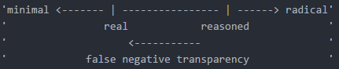
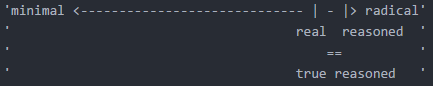
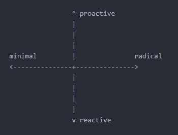

[Back to Review](../SR-WorkingReview-25072017-jmb.md)

# Conceptual Framework

- [Matrix Transparency](#matrix-transparency)
- [Single Dimension Classified Transparency](#single-dimension-classified-transparency)
- [Two Dimension Classified Transparency](#two-dimension-classified-transparency)
- [Other Models For Transparency](#other-models-for-transparency)

## Matrix Transparency
A simple classification matrix to help determine notable factors of a transparency system.

### Terms:
**Reasoned Transparency:** Government officials offer explicit explanations for their processes and actions.

**Radical Transparency:** Expanded release of information that can document how government officials actually behave, such as by disclosing meetings held between White House staff and outside groups.

**Proactive Transparency:** Creating or controlling a situation by releasing information rather than responding to it after it has been leaked or released by outside sources.

**Reactive Transparency:** Acting in response to a situation or release of information rather than creating or controlling the release of the information.

### Empty Template:
|     | reasoned | radical
| --- | --- | ---
| proactive | ????? | ?????
| *example-p* | ????? | ?????
| reactive | ????? | ?????
| *example-r* | ????? | ?????

### Example:
|     | reasoned | radical
| --- | --- | ---
| proactive | dedicated | indiscriminate
| *example-p* | *press release* | *Data.gov*
| reactive | contained | reconciled
| *example-r* | *hearing* | *WikiLeaks*

## Single Dimension Classified Transparency
A more complex classification system to help determine and compare transparency systems.

### Terms:
**Minimal Transparency:** An incredibly low level of information disclosure, negligible or holding no real value.

**Established Transparency:** The established or stated level of information to be received as public knowledge.

**Radical Transparency:** An incredibly high level of information disclosure,
significant or holding real value.

**False Negative Transparency:** The data available to the public has less information available than what the organization established or stated was to be public knowledge.

**False Positive Transparency:** The data available to the public has more information available than what the organization established or stated was to be public knowledge.

**True Transparency:** The data available to the public is equal to what was establish or stated to be received as public knowledge.

### Example:

In this example, there is a false negative transparency, exaggerated, from what the organization claims is available for public knowledge vs. what the public actual deems is available for public knowledge.

In this example, while there is a slight false negative transparency, the organization is claiming near radical transparency in their public knowledge data, and the public agrees that is near radical transparency, thus making the separation ignorable, resulting in a true transparency.

### Notes:
1. It is important to note that this should be read on an axis, where Minimal Transparency is on one side and Radical Transparency on the other.
2. At some point along the axis, an organization has their own individual Established Transparency, whether it be more towards Minimal, or Radical Transparency is determined by their internal methods.
3. Their True Transparency, is another point on the axis that is determined by the organizations constituents and where they believe the True Transparency actually is.
4. The space between the points can then be labeled by the above definitions.

## Two Dimension Classified Transparency
Yet another more complex classification system to compare varying classification systems by adding their activity as another axis.

### Terms:
**Minimal Transparency:** An incredibly low level of information disclosure, negligible or holding no real value.

**Established Transparency:** The established or stated level of information to be received as public knowledge.

**Radical Transparency:** An incredibly high level of information disclosure,
significant or holding real value.

**False Negative Transparency:** The data available to the public has less information available than what the organization established or stated was to be public knowledge.

**False Positive Transparency:** The data available to the public has more information available than what the organization established or stated was to be public knowledge.

**True Transparency:** The data available to the public is equal to what was establish or stated to be received as public knowledge.

**Proactive Transparency:** Creating or controlling a situation by releasing information rather than responding to it after it has been leaked or released by outside sources.

**Reactive Transparency:** Acting in response to a situation or release of information rather than creating or controlling the release of the information.

### Example:

## Other Models for Transparency

[Back to Review](../SR-WorkingReview-25072017-jmb.md)

[Back to Top](#conceptual-framework)
